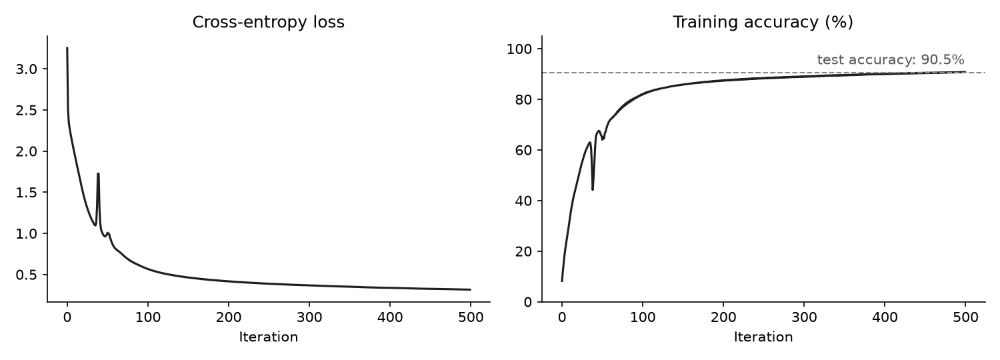
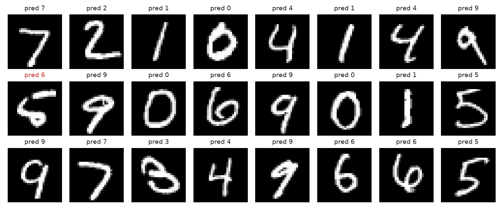
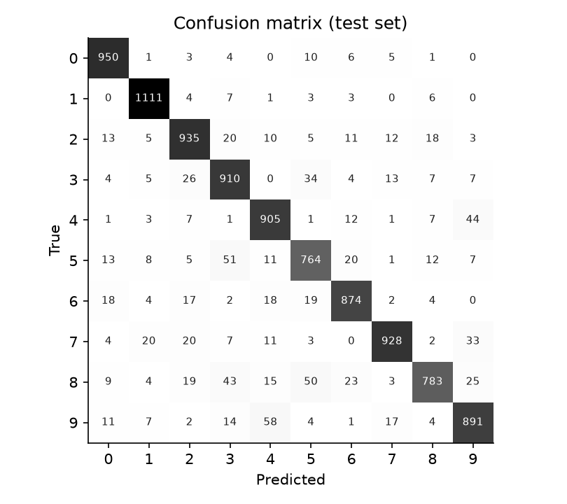
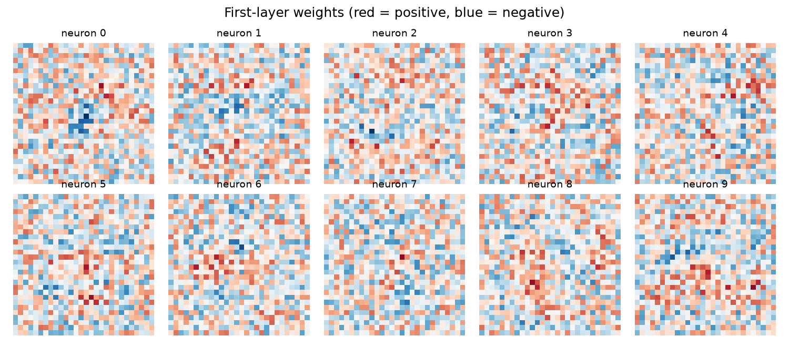

# MNIST Neural Network from Scratch

A small neural network that recognizes handwritten digits, written with nothing but NumPy. No PyTorch, no TensorFlow. Forward pass, backpropagation and gradient descent are all done by hand.

It gets **90.5% accuracy** on the MNIST test set.



## How it works

The network has two layers: 784 inputs (one per pixel), 10 hidden neurons with ReLU, and 10 outputs with softmax.

Forward pass:

$$
Z_1 = W_1 X + b_1, \quad A_1 = \text{ReLU}(Z_1), \quad Z_2 = W_2 A_1 + b_2, \quad A_2 = \text{softmax}(Z_2)
$$

Backward pass (with one-hot labels $Y$ and $m$ training examples):

$$
dZ_2 = A_2 - Y, \quad dW_2 = \tfrac{1}{m} dZ_2 A_1^T, \quad db_2 = \tfrac{1}{m} \textstyle\sum dZ_2
$$

$$
dZ_1 = W_2^T dZ_2 \odot \text{ReLU}'(Z_1), \quad dW_1 = \tfrac{1}{m} dZ_1 X^T, \quad db_1 = \tfrac{1}{m} \textstyle\sum dZ_1
$$

Then every parameter is updated with $W \leftarrow W - \alpha \, dW$.

I trained it with full-batch gradient descent on all 60,000 training images, learning rate 0.5, for 500 iterations. It takes about 10 seconds on a laptop.

## Results

Predictions on test images (wrong ones in red):



Most mistakes happen between digits that look alike, like 4 and 9 or 3 and 5:



The first-layer weights of each hidden neuron, reshaped back into 28x28 images:



## Running it

```bash
pip install -r requirements.txt
python mnist.py
```

You need the MNIST CSV files in `dataset/` first. See [dataset/README.md](dataset/README.md) for where to get them.
